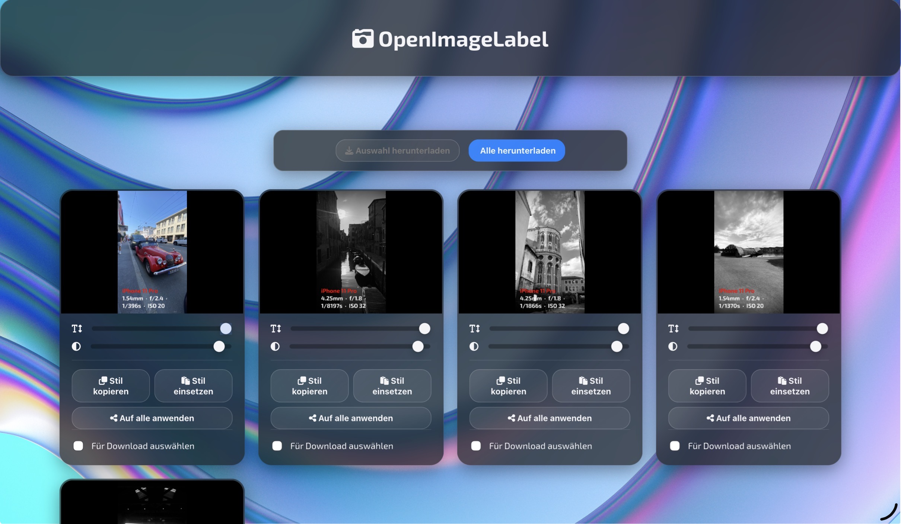

<div align="center">

# 🚀 Bahrian Novotny's Universe

### *An Interactive 3D Space Portfolio Experience*

[](https://professorengineergit.github.io/Bahrian_Novotny_My_Universe/)
[](https://www.gnu.org/licenses/agpl-3.0)
[](https://threejs.org/)

*Navigate the cosmos aboard the USS Enterprise-D and discover planets in an immersive 3D environment*

</div>

---

## 📸 Screenshots

<div align="center">

### Main Interface

*The USS Enterprise-D navigating through a procedurally generated galaxy*

### Interactive Experience

*Planetary analysis interface with real-time object inspection*

### Development Setup

*Audio synthesis setup for the ambient soundscape*

</div>

---

## 📖 Table of Contents

- [About](#-about)
- [Features](#-features)
- [Technology Stack](#-technology-stack)
- [How to Use](#-how-to-use)
- [Controls](#-controls)
- [How It Works](#-how-it-works)
- [Project Mariner: Development Journey](#-project-mariner-development-journey)
- [Installation](#-installation)
- [About the Author](#-about-the-author)
- [License](#-license)

---

## 🌌 About

Hi, I'm **Bahrian Novotny** — a 15-year-old high school student with a deep fascination for science, technology, and the endless possibilities they open up.

From exploring the mechanics of the universe to experimenting with creative coding and engineering, I'm constantly looking for new ways to learn, build, and share ideas.

This website grew out of that passion. For over a year, I had planned to build a portfolio site — but I wanted something different. Something exciting. Something **interactive**.

**Welcome to my universe.**

---

## ✨ Features

🎮 **Interactive 3D Navigation**
- Pilot the iconic USS Enterprise-D through a procedurally generated galaxy
- Smooth joystick controls for intuitive spacecraft maneuvering
- Touch-friendly interface optimized for mobile and tablet devices

🪐 **Dynamic Planetary System**
- Explore multiple planets with unique characteristics
- Intelligent planet distribution ensuring optimal spacing
- Time-synchronized planetary motion with dynamic pause/resume mechanics

🔬 **Object Analysis System**
- Enter a planet's inner sphere to trigger analysis mode
- Detailed information overlays for each celestial body
- Smooth transitions between navigation and analysis modes

🎵 **Immersive Audio**
- Custom ambient soundscape ("Arcadia")
- Toggle-able audio controls
- Seamless looping for continuous atmosphere

✨ **Advanced Visual Effects**
- Bloom effects for enhanced visual depth
- CSS2D labels for interactive object identification
- Hyperspace loading animation with particle effects
- Real-time galaxy rendering with 150,000+ particles

🚀 **Quick Warp Navigation**
- Instant travel to any discovered planet
- User-friendly destination selector
- Smooth warp animation transitions

---

## 🛠 Technology Stack

| Technology | Purpose |
|-----------|---------|
| **[Three.js](https://threejs.org/)** (v0.150.1) | 3D rendering engine |
| **[GLTF/GLB](https://www.khronos.org/gltf/)** | 3D model format for USS Enterprise-D |
| **[Draco Decoder](https://google.github.io/draco/)** | Compressed 3D geometry loading |
| **[CSS2DRenderer](https://threejs.org/docs/#examples/en/renderers/CSS2DRenderer)** | HTML labels in 3D space |
| **[Unreal Bloom Pass](https://threejs.org/docs/#examples/en/postprocessing/UnrealBloomPass)** | Post-processing bloom effects |
| **[nipplejs](https://yoannmoi.net/nipplejs/)** | Virtual joystick controls |
| **HTML5 Canvas** | WebGL rendering context |
| **ES6 Modules** | Modern JavaScript architecture |
| **Nasalization Font** | Futuristic UI typography |

---

## 🎮 How to Use

1. **Visit the Live Site**: Navigate to [Bahrian's Universe](https://professorengineergit.github.io/Bahrian_Novotny_My_Universe/)
2. **Wait for Loading**: Watch the hyperspace loading animation as assets load
3. **Navigate**: Use the joystick (bottom-left) to pilot the USS Enterprise-D
4. **Explore**: Fly towards planets to discover what they contain
5. **Analyze**: Get close to a planet and click "Analyze Object" to learn more
6. **Warp**: Use the "Quick Warp" button to instantly travel to discovered locations

---

## 🕹 Controls

### Desktop / Laptop
- **Mouse Drag (1 finger)**: Rotate camera view
- **Mouse Wheel / Pinch (2 fingers)**: Zoom in/out
- **Joystick (virtual)**: Move the USS Enterprise-D
- **Click "Analyze Object"**: Examine nearby celestial bodies

### Mobile / Tablet
- **Single Finger Swipe**: Rotate camera
- **Two Finger Pinch**: Zoom
- **Virtual Joystick**: Navigate spacecraft
- **Tap "Analyze Object"**: Inspect planets

### Additional Controls
- **Mute Button**: Toggle ambient audio on/off
- **Quick Warp Button**: Open destination menu for instant travel
- **Close (X)**: Exit analysis window

---

## ⚙️ How It Works

### Procedural Galaxy Generation
The scene features a **procedurally generated spiral galaxy** with:
- **150,000 particles** forming three distinct spiral arms
- Dynamic color gradients from blue (core) to red (outer edges)
- Randomized spin and distribution for organic appearance

### Physics-Based Motion
Each planet follows a **sophisticated motion algorithm**:
1. Planets maintain maximum distance from each other to prevent overlap
2. When the ship enters analysis range, the planet **pauses** its motion
3. Upon exiting, the planet **accelerates** to its predicted position as if it had never stopped
4. Smooth interpolation ensures realistic orbital mechanics

### Optimized Rendering
- **Bloom post-processing** for luminous effects on stars and particles
- **Level of Detail (LOD)** management for performance
- **Frustum culling** to render only visible objects
- **Compressed GLTF models** with Draco encoding for fast loading

---

## 🚀 Project Mariner: Development Journey

### Phase 1: The Prototype
It all began with a simple HTML prototype. Instead of the ship you see now, there was a **pyramid** you could steer in the most basic way using a joystick, along with some very early camera rotation controls.

### Phase 2: Refinement
About a week later, I had refined both the design and the functionality. I realized that by limiting the controls, the site would feel more polished — so I made the camera snap back to a fixed position and only allowed permanent zoom adjustments.

### Phase 3: The Enterprise
Around that time, I replaced the pyramid with the **USS Enterprise-D** and introduced a loading screen with a hyperspace effect.

### Phase 4: Planetary System
Next came the planets. The tricky part was making sure they stayed **as far apart from each other as possible**. Finally, I implemented a feature where, when the ship enters a planet's inner sphere to analyze it, the planet stops moving — and as soon as the ship leaves, it accelerates to catch up to the position it would have reached had it never stopped.

### Phase 5: Polish & Features
The final stages involved:
- Adding the Quick Warp navigation system
- Implementing the analysis overlay interface
- Creating custom audio with the "Arcadia" track
- Optimizing performance for mobile devices
- Adding accessibility features and proper labeling

---

## 💻 Installation

Want to run this locally? Follow these steps:

```bash
# Clone the repository
git clone https://github.com/ProfessorEngineergit/Bahrian_Novotny_My_Universe.git

# Navigate to the project directory
cd Bahrian_Novotny_My_Universe

# Serve the files (use any local server, e.g., Python or Node.js)
# Option 1: Python 3
python -m http.server 8000

# Option 2: Node.js (requires http-server package)
npx http-server -p 8000

# Open your browser to http://localhost:8000
```

**Note**: Due to ES6 module imports and CORS restrictions, you **must** serve the files through a web server. Simply opening `index.html` directly won't work.

---

## 👨‍💻 About the Author

**Bahrian Novotny** is a 15-year-old high school student passionate about:
- 🔬 Physics and Space Science
- 💻 Web Development & 3D Graphics
- 🎵 Audio Synthesis and Sound Design
- 🚀 Science Fiction and Technology
- 🛠 Engineering and Creative Coding

This project represents over a year of learning, experimentation, and refinement in web-based 3D graphics, interactive design, and creative coding.

### Connect
- **GitHub**: [@ProfessorEngineergit](https://github.com/ProfessorEngineergit)
- **Live Portfolio**: [Bahrian's Universe](https://professorengineergit.github.io/Bahrian_Novotny_My_Universe/)

---

## 📄 License

This project is licensed under the **GNU Affero General Public License v3.0** (AGPL-3.0).

See the [LICENSE](LICENSE) file for full details.

---

## 🙏 Acknowledgments

- **Three.js Community** - For the incredible 3D engine and examples
- **Star Trek** - For inspiring the use of the USS Enterprise-D
- **Open Source Contributors** - For the libraries that made this possible

---

<div align="center">

### 🌟 If you enjoyed exploring my universe, consider starring this repository!

**Made with ❤️ by Bahrian Novotny**

*"To boldly go where no portfolio has gone before..."* 🖖

</div>
