<div align="center">

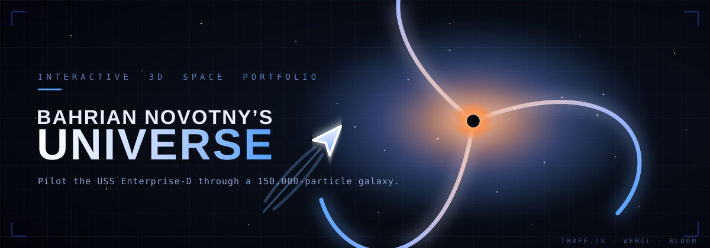

<br/>

[](https://professorengineergit.github.io/Bahrian_Novotny_My_Universe/)
[](https://threejs.org/)
[](https://get.webgl.org/)
[](https://www.gnu.org/licenses/agpl-3.0)

*Pilot the USS Enterprise-D through a procedurally generated, 150,000-particle galaxy — and discover that every planet is a real project.*

</div>

---

## 🌌 The Experience

<div align="center">
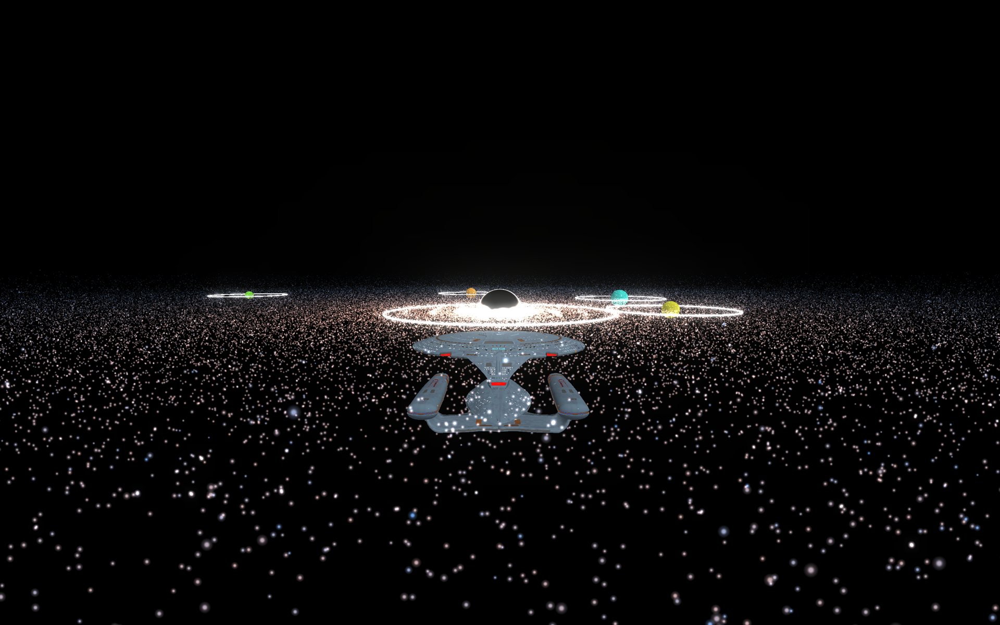
<br/>
<em>A live frame: the Enterprise-D, a gravitationally-lensed black hole with a glowing accretion disk, and eight orbiting worlds — all in real-time WebGL.</em>
</div>

<br/>

Hi, I'm **Bahrian Novotny** — a 15-year-old high-school student fascinated by science, engineering and creative coding. For over a year I wanted a portfolio, but a flat website felt wrong. So I built a **universe** you can fly through instead. Every planet is one of my real projects; fly close, and it opens up.

> **Welcome to my universe.** 🖖

---

## 📖 Table of Contents

- [The Experience](#-the-experience)
- [Project Mariner — The Evolution](#-project-mariner--the-evolution)
- [Exploded View — How It's Built](#-exploded-view--how-its-built)
- [Features](#-features)
- [Controls](#-controls)
- [How It Works](#️-how-it-works)
- [The Planets Are Real Projects](#-the-planets-are-real-projects)
- [Roadmap](#-roadmap)
- [Run It Locally](#-run-it-locally)
- [Tech Stack](#-tech-stack)
- [About the Author](#-about-the-author)
- [License](#-license)

---

## 🚀 Project Mariner — The Evolution

> I don't have screenshots of the earliest builds anymore, so the first three stages below are **faithful reconstructions** drawn from the original code and notes. Everything from *Procedural Surfaces* onward is a **real, captured frame** of the site as it runs today.

This site wasn't designed in one go — it *grew*. Here is the whole journey, stage by stage.

<br/>

### ◢ Phase 01 — The Low-Poly Prototype

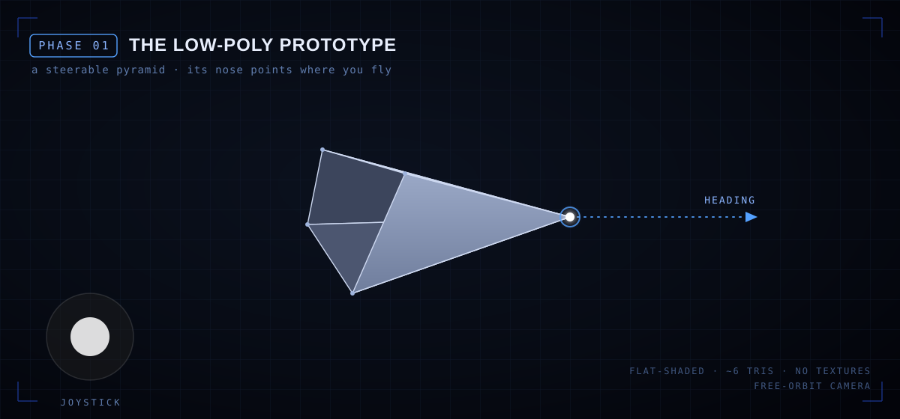

It all started with the crudest thing that could possibly move: a **flat-shaded, low-poly pyramid** — really a cone gone angular. Its pointed nose existed for one reason: to show which way you were heading. A virtual joystick moved it, and the camera could orbit freely. No textures, no lighting tricks — just the core idea: *you, steering something, through space.*

<br/>

### ◢ Phase 02 — Disciplined Controls

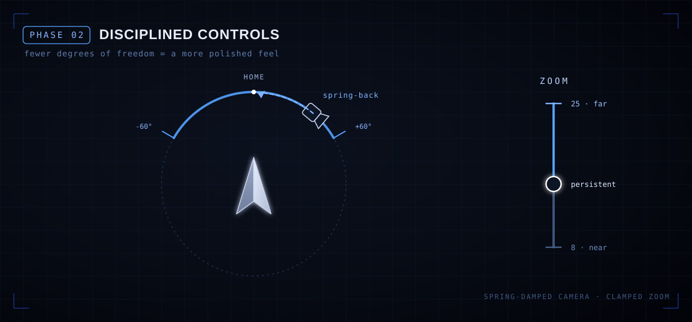

A week later I realised that **fewer degrees of freedom felt more polished**. The free-flying camera became a spring-damped one: you can swing the view within a ±60° window, but let go and it **snaps back home**. Zoom became the only *persistent* control — clamped between near and far. Constraints, it turns out, feel like craftsmanship.

<br/>

### ◢ Phase 03 — A System of Worlds

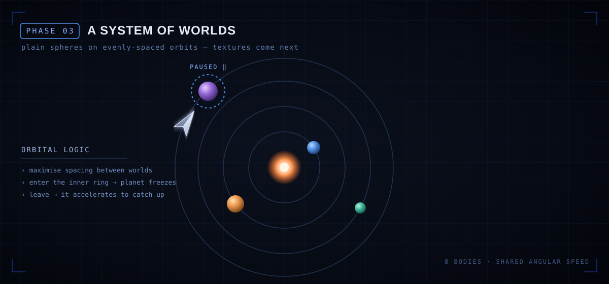

Next, the void got company: **planets**. The hard part wasn't drawing them — it was keeping them **as far apart as possible** so the system never looked cluttered. They share one angular speed for clean, even spacing. And the mechanic I'm proudest of was born here: **fly into a planet's inner ring and it freezes**; leave, and it *accelerates to catch up* to exactly where it would have been. At this stage the spheres were still plain, flat colours.

<br/>

### ◢ Phase 04 — Procedural Surfaces

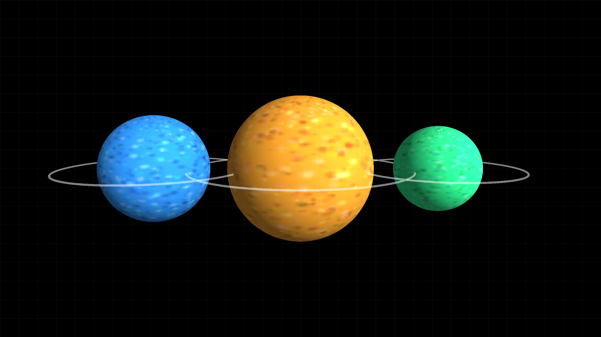

Then the worlds got skin. Each planet's surface is a **procedural canvas texture**, generated at runtime: an HSL base colour speckled with ~3,000 randomized dots for a noisy, organic look — no two planets alike. Lit with a standard material so the terminator (the day/night edge) reads properly.

<br/>

### ◢ Phase 05 — Enter the Enterprise

<table>
<tr>
<td width="58%">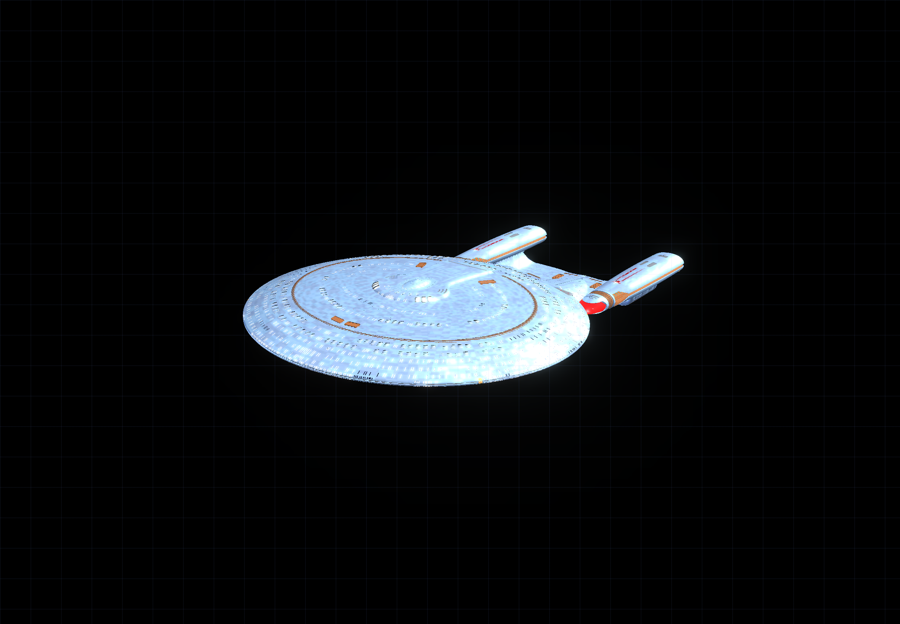</td>
<td width="42%">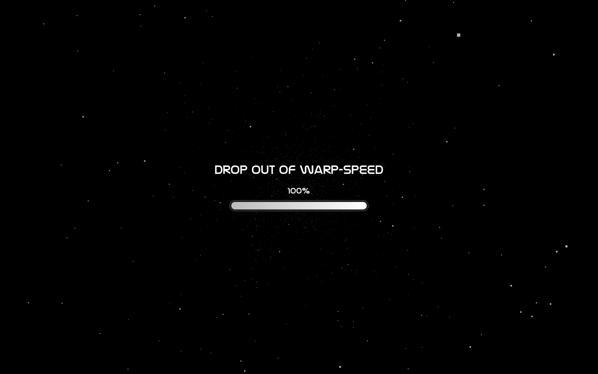</td>
</tr>
</table>

The pyramid had served its purpose — time for a real ship. In came the **USS Enterprise-D**, a `Draco`-compressed `.glb` model (≈9 MB, decoded on the fly), wrapped in a **hyperspace loading screen** that streaks 5,000 particles toward you until the assets land and you *"Drop out of Warp-Speed."*

<br/>

### ◢ Phase 06 — The Heart of the Galaxy


The centrepiece arrived: a **150,000-particle spiral galaxy** (three arms, additive blending, blue-to-amber gradient) wrapped around a **black hole** — a black core, a canvas-painted **accretion disk**, and a **gravitational-lensing** sphere that refracts the scene behind it using a live cube-camera. **UnrealBloom** post-processing ties it all together with a luminous glow.

<br/>

### ◢ Phase 07 — The Dark Glass Interface

<table>
<tr>
<td width="50%">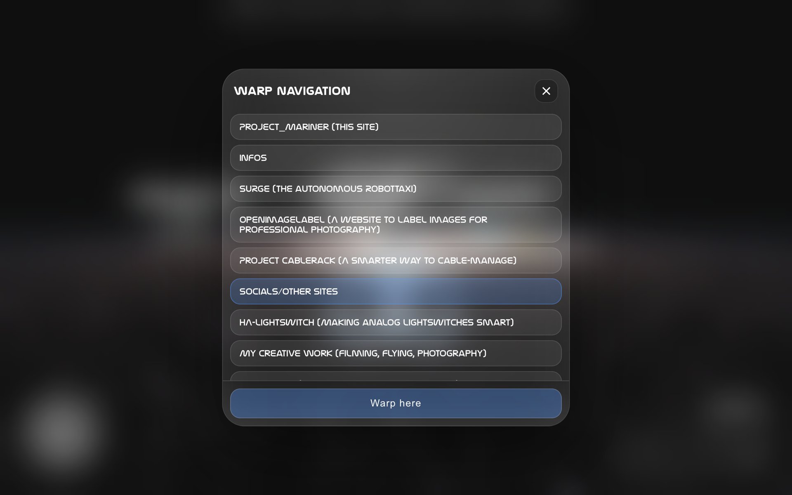</td>
<td width="50%">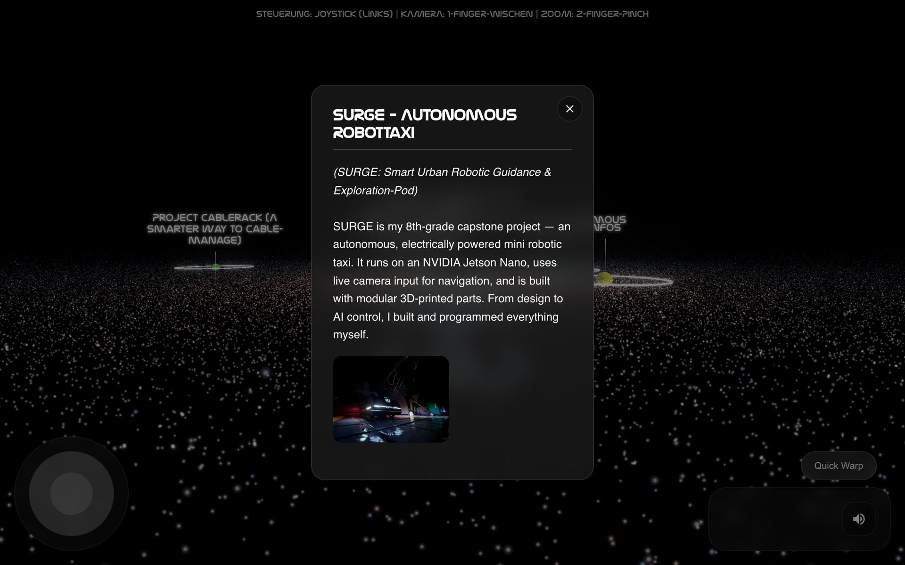</td>
</tr>
</table>

Finally, the **Dark Glass** UI: semi-transparent, frosted (`backdrop-filter: blur`) panels with hairline borders and soft glow on hover — all set in the futuristic **Nasalization** typeface. **Quick Warp** *(left)* jumps you to any discovered world; the **Analysis window** *(right)* opens a planet's full story, text and images. This is the layer that turned a tech demo into a *portfolio*.

---

## 🧩 Exploded View — How It's Built

Every frame is assembled bottom-up, one layer on top of the next, in a single WebGL canvas:

<div align="center">
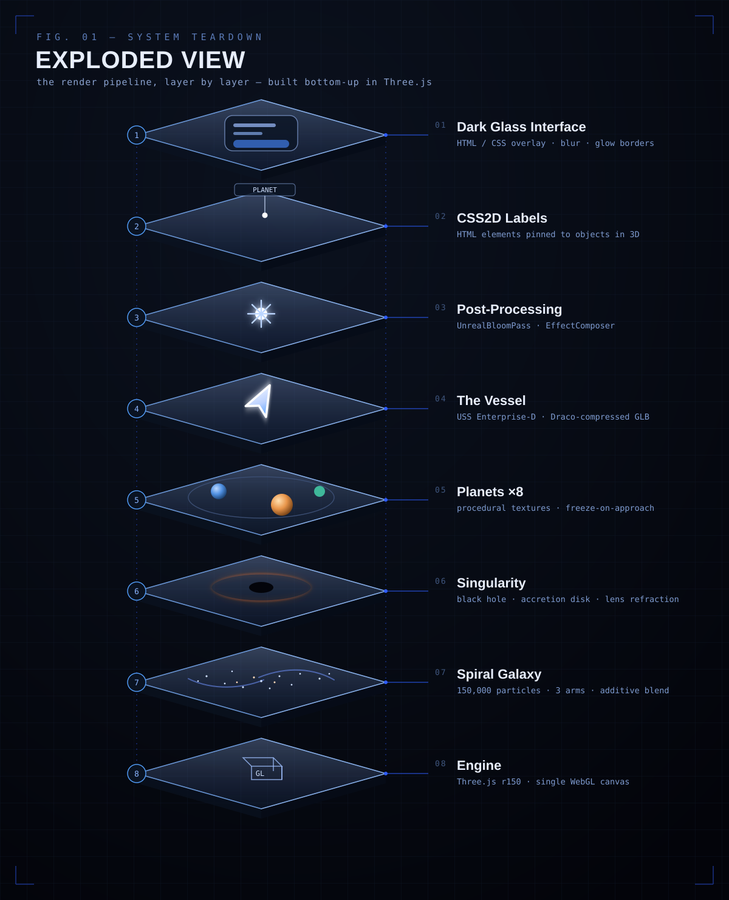
</div>

| # | Layer | What it does |
|---|-------|--------------|
| 8 | **Engine** | `Three.js r150` scene, camera & a single WebGL renderer |
| 7 | **Spiral Galaxy** | 150,000 additive-blended particles forming 3 arms |
| 6 | **Singularity** | Black hole core + accretion disk + live lens refraction |
| 5 | **Planets ×8** | Procedurally textured worlds with freeze-on-approach orbits |
| 4 | **The Vessel** | USS Enterprise-D, Draco-compressed GLB |
| 3 | **Post-Processing** | `UnrealBloomPass` through an `EffectComposer` |
| 2 | **CSS2D Labels** | HTML labels pinned to objects in 3D space |
| 1 | **Dark Glass Interface** | HTML/CSS overlay — blur, glow, the controls |

---

## ✨ Features

🎮 **Interactive 3D flight** — pilot the Enterprise with a touch joystick (`nipplejs`) or `WASD`, with a self-centering camera.

🪐 **Living planetary system** — eight worlds on evenly-spaced orbits that **pause when you approach** and **catch back up** when you leave.

🔬 **Object analysis** — enter a planet's inner sphere and open a Dark Glass overlay with its full story, text and images.

🌀 **Real-time galaxy & black hole** — 150k-particle spiral, accretion disk, and a gravitational-lensing sphere driven by a cube-camera.

✨ **Cinematic post-processing** — `UnrealBloom` glow over the whole scene, plus a particle hyperspace loading screen.

🚀 **Quick Warp** — jump instantly to any discovered destination.

🎵 **Ambient audio** — a custom looping soundtrack ("Arcadia") with a mute toggle.

📱 **Touch-first & responsive** — built for phones and tablets, safe-area aware.

---

## 🕹 Controls

| Action | Desktop | Touch |
|--------|---------|-------|
| **Move ship** | `W` `A` `S` `D` | Virtual joystick (bottom-left) |
| **Look around** | Click + drag | One-finger swipe |
| **Zoom** | Mouse wheel | Two-finger pinch |
| **Analyze** | Click **Analyze Object** | Tap **Analyze Object** |
| **Quick Warp** | Click **Quick Warp** | Tap **Quick Warp** |
| **Mute** | Click 🔊 | Tap 🔊 |

> Get within a planet's glowing ring and the **Analyze Object** button lights up — that's your cue.

---

## ⚙️ How It Works

**Procedural galaxy.** 150,000 points are distributed across three logarithmic spiral arms with randomized scatter (`Math.pow` falloff), coloured along a gradient from a warm core to cool edges, and drawn with a soft radial sprite under additive blending.

**Freeze & catch-up orbits.** All planets share one global angular speed, so their phase offsets stay constant and they never bunch up. When the ship enters a planet's boundary ring, that planet's orbit pivot stops; when you leave, it lerps toward the position it *would* have reached — as if it never paused.

**Gravitational lensing.** A `CubeCamera` re-renders the surroundings into a cube map each frame (with the black hole, disk and lens temporarily hidden), which a refractive sphere then samples — bending the galaxy behind it.

**Performance.** The model ships as a Draco-compressed GLB, particles use a single buffer geometry, and the whole scene renders through one `EffectComposer` pass.

---

## 🛰 The Planets Are Real Projects

The universe is a portfolio in disguise — each world is something I actually built:

| Planet | Project |
|--------|---------|
| **SURGE** | An autonomous, 3D-printed robotic mini-taxi on an NVIDIA Jetson Nano (8th-grade capstone) |
| **OpenImageLabel** | A web tool that turns EXIF data into clean, batch-exportable photo overlays |
| **Project Cablerack** | A custom sheet-metal rack: one-cable desk, HDMI switching, ARGB cooling, Apple Home |
| **HA-Lightswitch** | A servo add-on that makes analog wall switches smart via Home Assistant + MQTT |
| **Creative Work** | Cinematic drone storytelling with a DJI Mini 2 |
| **3D-Printing** | From CAD concepts to finished parts — my go-to engineering tool |

<div align="center">
<table>
<tr>
<td><br/><sub><em>SURGE — autonomous robotic taxi</em></sub></td>
<td><br/><sub><em>Project Cablerack</em></sub></td>
<td><br/><sub><em>OpenImageLabel</em></sub></td>
</tr>
</table>
</div>

---

## 🗺 Roadmap

Things I want to refine next *(ideas and known issues — contributions welcome)*:

- [ ] **Reverse-thrust steering** — invert turn direction when flying backwards so controls stay intuitive.
- [ ] **Tap-to-zoom images** — let analysis-window images expand to fullscreen on tap.
- [ ] **Fix Quick Warp** — `closeWarpOverlay()` currently clears the chosen target *before* the delayed `performWarp()` reads it, so the jump never fires. *(Found while documenting this README.)*
- [ ] **Even more atmosphere** — richer nebulae, lens flares, and motion cues to make it look *crazier*.
- [ ] **Deep Space mode**, newsletter & overview functions, and Blender-crafted planets *(planned for V1.5 Pro / V2.0)*.

---

## 💻 Run It Locally

Because of ES6 modules and CORS, you **must** serve the files — opening `index.html` directly won't work.

```bash
# Clone
git clone https://github.com/ProfessorEngineergit/Bahrian_Novotny_My_Universe.git
cd Bahrian_Novotny_My_Universe

# Serve (pick one)
python3 -m http.server 8000     # then open http://localhost:8000
npx http-server -p 8000
```

---

## 🛠 Tech Stack

| Technology | Purpose |
|-----------|---------|
| **[Three.js](https://threejs.org/)** (r150) | 3D rendering engine |
| **[GLTFLoader](https://threejs.org/docs/#examples/en/loaders/GLTFLoader) + [Draco](https://google.github.io/draco/)** | Compressed Enterprise-D model |
| **[EffectComposer](https://threejs.org/docs/#examples/en/postprocessing/EffectComposer) · [UnrealBloomPass](https://threejs.org/docs/#examples/en/postprocessing/UnrealBloomPass)** | Bloom post-processing |
| **[CSS2DRenderer](https://threejs.org/docs/#examples/en/renderers/CSS2DRenderer)** | HTML labels in 3D space |
| **[CubeCamera](https://threejs.org/docs/#api/en/cameras/CubeCamera)** | Live cube map for lens refraction |
| **[nipplejs](https://yoannmoi.net/nipplejs/)** | Virtual joystick |
| **Canvas 2D textures** | Procedural planet & accretion-disk surfaces |
| **Nasalization** | Futuristic UI typeface (self-hosted woff/woff2) |

---

## 👨‍💻 About the Author

**Bahrian Novotny** — 15, high-school student, into physics & space, web & 3D graphics, audio/sound design, sci-fi, and engineering. This project is over a year of learning packed into one place I'm proud of.

- **GitHub:** [@ProfessorEngineergit](https://github.com/ProfessorEngineergit) · **School:** [@makerLab314](https://github.com/makerLab314)
- **Drone work:** [YouTube](https://www.youtube.com/@droneXplorer-t1n) · [Skypixel](https://www.skypixel.com/users/till-bahrian)
- **Live site:** [Bahrian's Universe](https://professorengineergit.github.io/Bahrian_Novotny_My_Universe/)

---

## 📄 License

Licensed under the **GNU Affero General Public License v3.0 (AGPL-3.0)** — see [LICENSE](LICENSE).

---

## 🙏 Acknowledgments

- **Three.js community** — for the engine and the examples I learned from
- **Star Trek** — for the USS Enterprise-D
- Everyone whose open-source work made this possible

---

<div align="center">

### 🌟 If you enjoyed exploring my universe, consider giving it a star!

**Made with ❤️ by Bahrian Novotny**

*"To boldly go where no portfolio has gone before…"* 🖖

</div>
